# 图像分割基础教程
## 语义分割算法的根本目的：像素级分类！
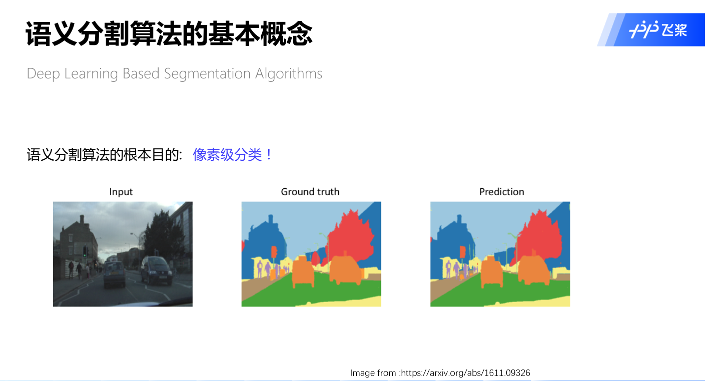
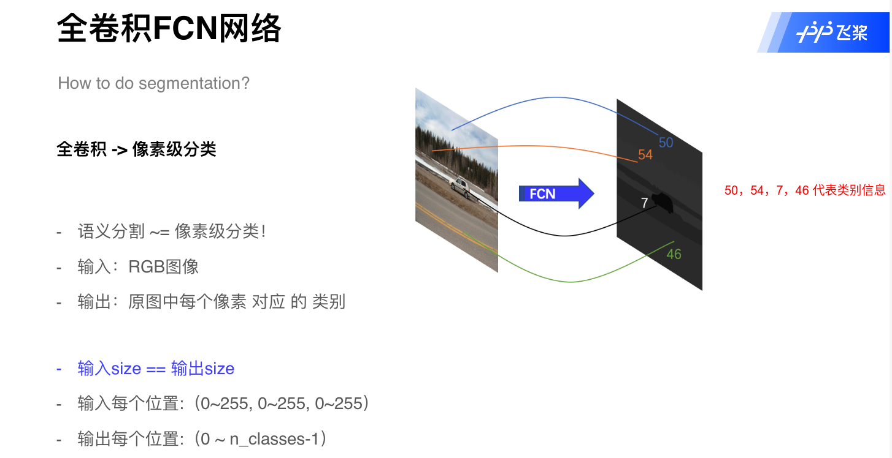

* 全卷积从分类到分割
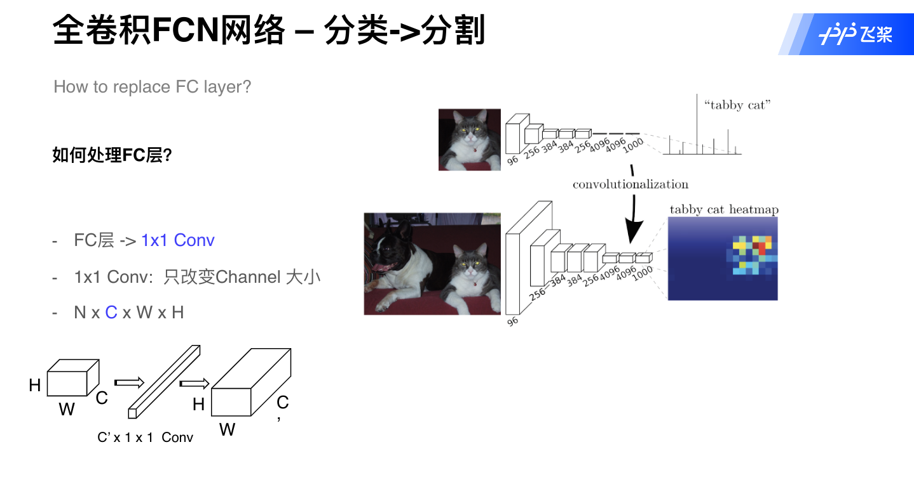
  

## 语义分割算法的基本流程
  
  
## 语义分割性能指标
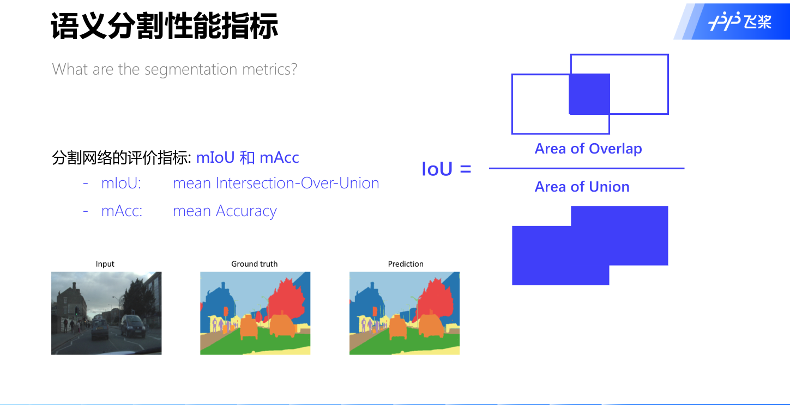
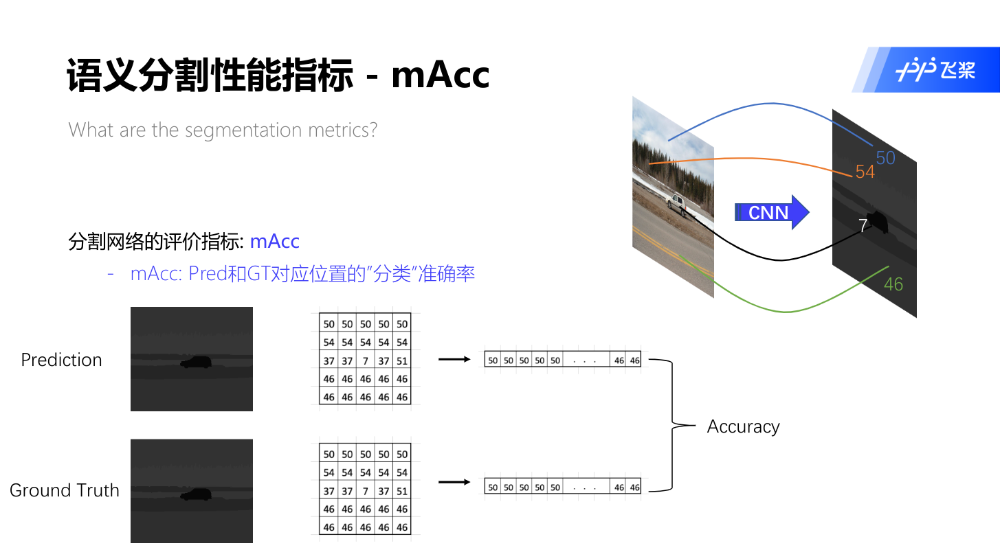
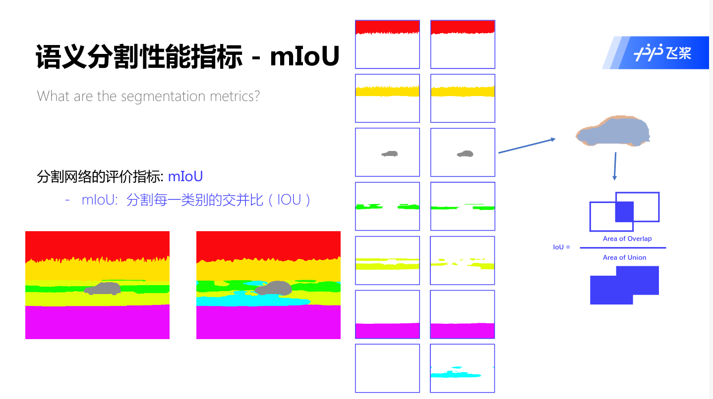

### 图像分割类型
1. 语义分割：给每个pixel分类
2. 实例分割：给每个框里的object分mask
3. 全景分割：背景pixel分类+框里mask  

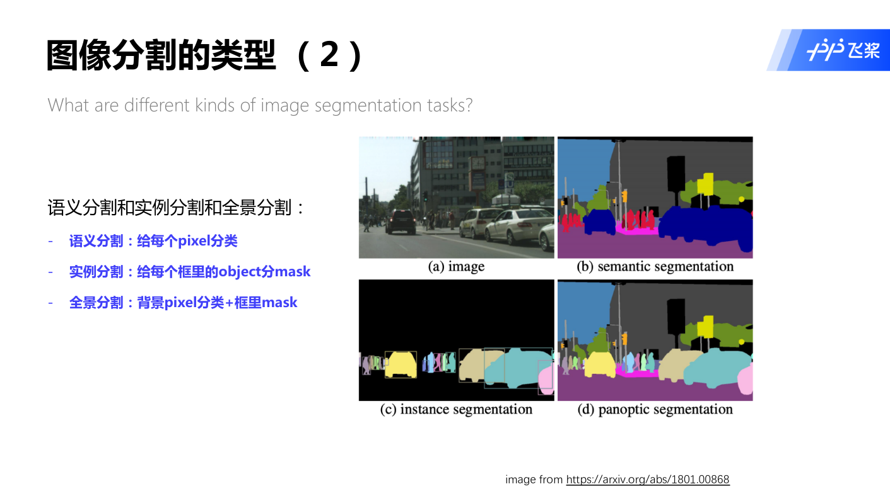

### 视频目标分割
1. 通常会给定目标mask，然后求特定目标的mask

### 视频实例分割
1. 根据目标检测的框，求目标的mask

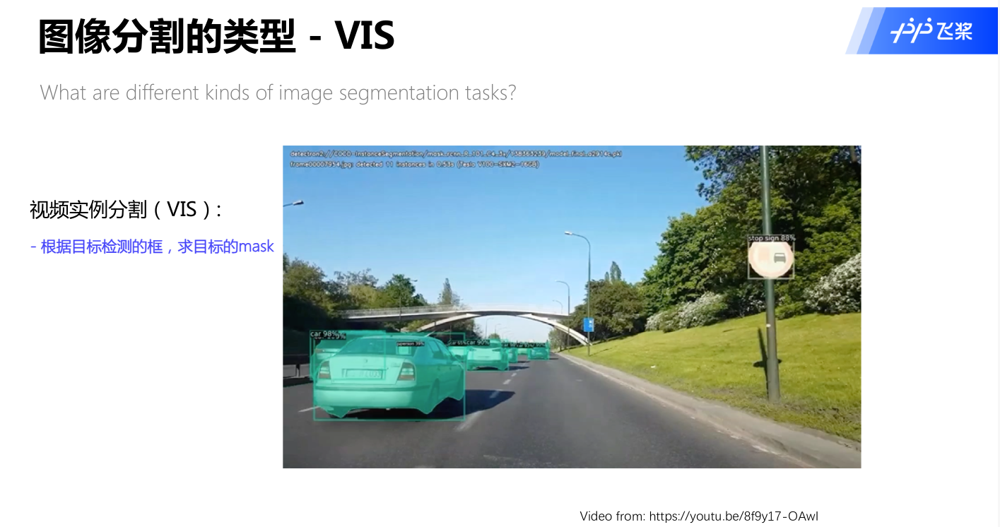

### 图像分割的上采样方法
* 1 双线性插值
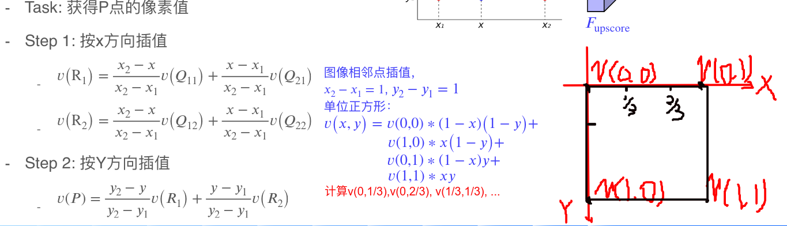
`v(0,0),v(0,1),v(1,0),v(1,1)`是定义在图像坐标系下的坐标值
* 2 反池化  
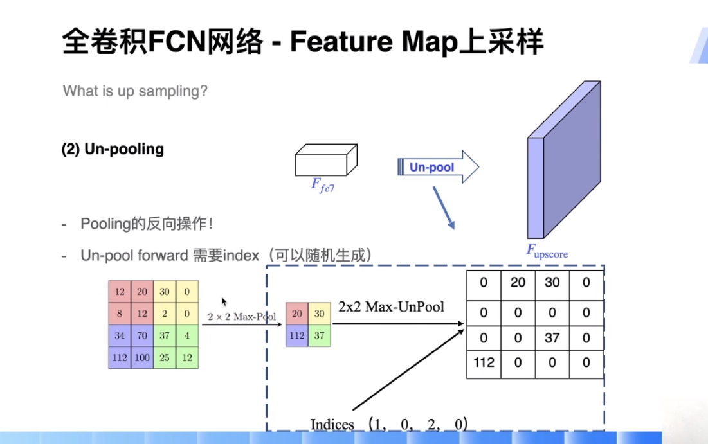

* 3 Transpose Conv(转置卷积)
标准卷积的矩阵表示
  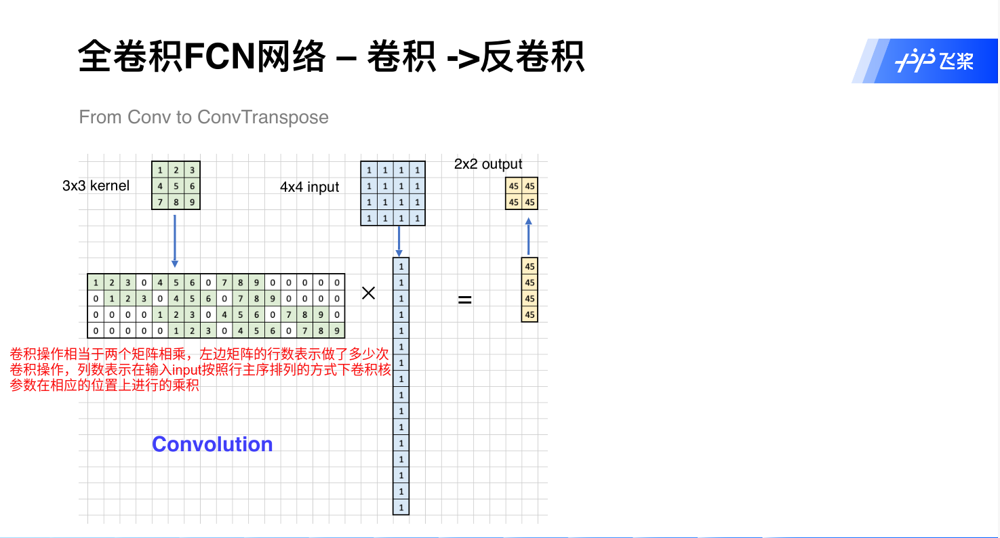
  
转置卷积操作的矩阵表示  
转置卷积操作步骤：  
先把卷积核顺时针旋转180度或者对卷积核分别执行上下翻转和左右翻转，  
然后在加了`padding`操作的输入`input`上执行正常的卷积操作
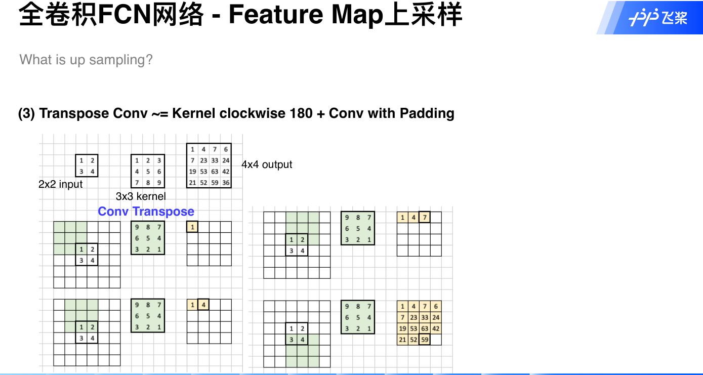  
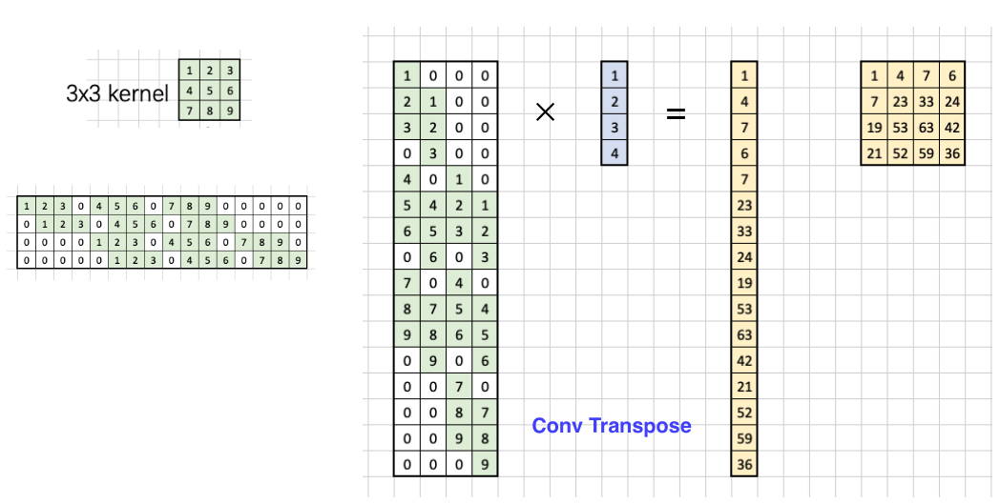

### 自适应池化操作
`hs,he,ws,we`表示进行池化操作的窗口大小以及起始点和重点坐标位置
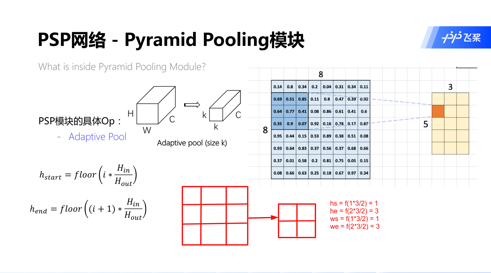

### 空洞卷积`Dilated Conv`
* 空洞卷积可以扩大卷积之后的感受野信息，进而获取更多的上下文信息，同时不增加参数数量  
空洞卷积的操作相当于扩大了卷积核的大小，扩充的地方进行补零操作
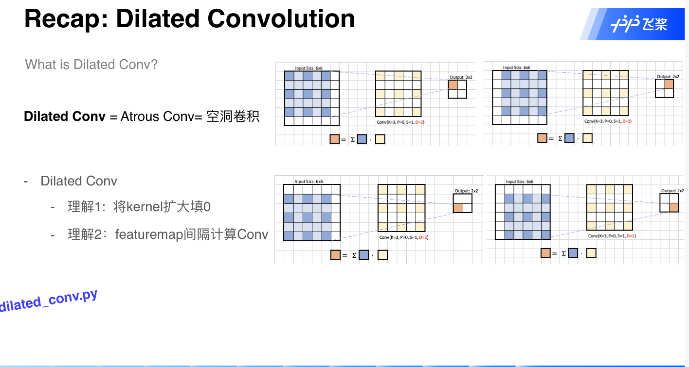  
* 空洞卷积与普通卷积  
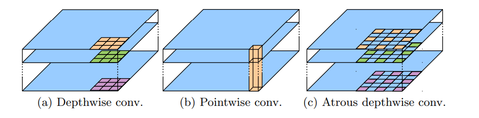
* 空洞卷积输出大小的计算公式
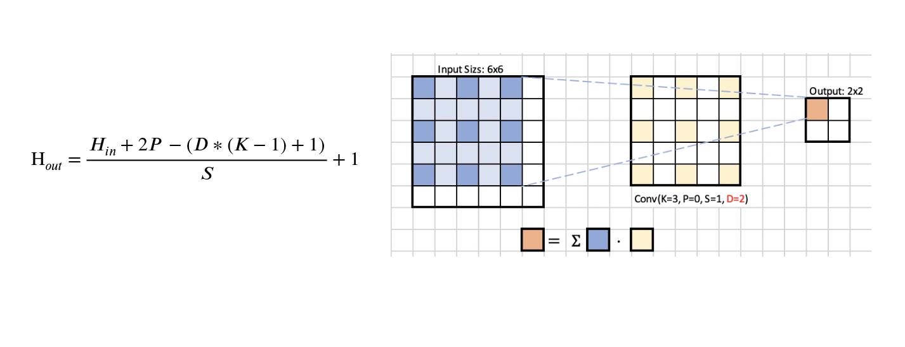  

### deeplabv3p解读
* [deeplabv3p文章](docs/deeplabv3p.pdf)
* deeplabv3p编解码流程图
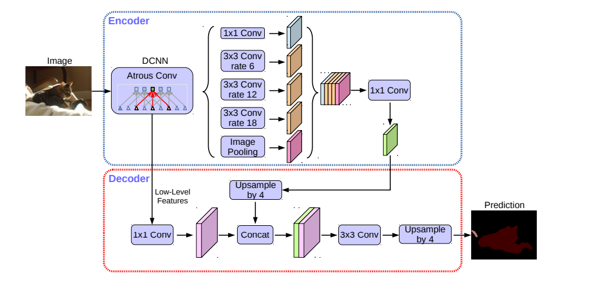
* deeplabv3p网络结构垂直编解码流程图  
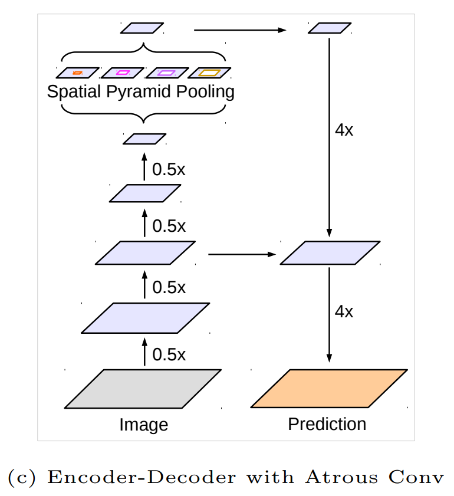
  
## 参考链接
* 1 [图像分割综述](https://aistudio.baidu.com/aistudio/education/preview/1838052)
* 2 [FCN全卷积网络详解](https://aistudio.baidu.com/aistudio/education/preview/756664)
* 3 

