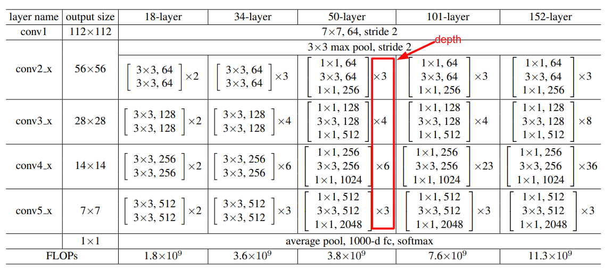

## resnet_vd.py 代码解析

## resnet网络结构

```python
        if layers == 18:
            depth = [2, 2, 2, 2]
        elif layers == 34 or layers == 50:
            depth = [3, 4, 6, 3]
        elif layers == 101:
            depth = [3, 4, 23, 3]
        elif layers == 152:
            depth = [3, 8, 36, 3]
        elif layers == 200:
            depth = [3, 12, 48, 3]
        num_channels = [64, 256, 512, 1024
                        ] if layers >= 50 else [64, 64, 128, 256]
        num_filters = [64, 128, 256, 512]
```
`depth`列表中的数值分别表示`conv2_x`、`conv3_x`、`conv4_x`、`conv5_x`神经网络模块的个数