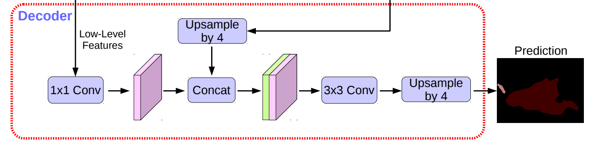
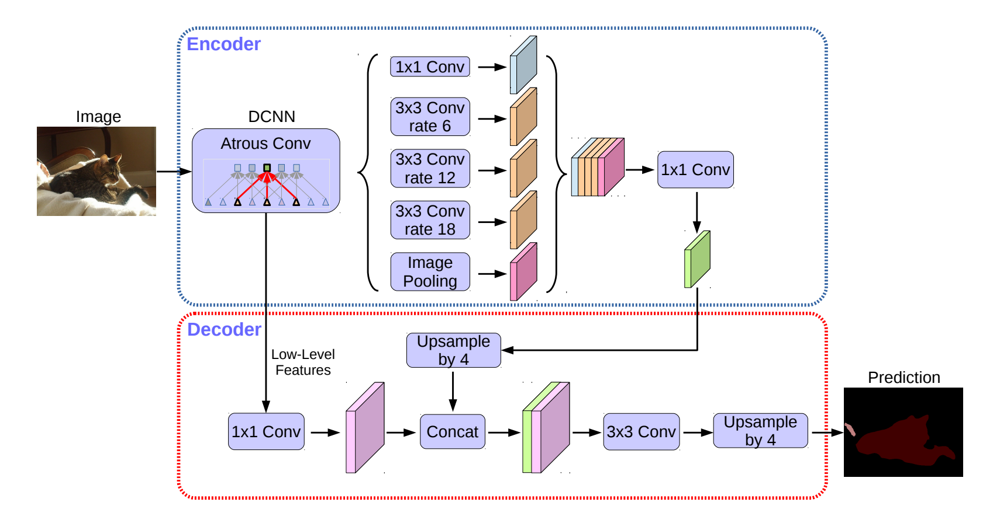

## deeplab.py 代码解析

## align_corners角点对齐操作
* [对输入数据进行上采样操作时的角点对齐方法](https://blog.csdn.net/wangweiwells/article/details/101820932)


## Decoder流程
```python
Decoder(nn.Layer):
    """
    Decoder module of DeepLabV3P model

    Args:
        num_classes (int): The number of classes.
        in_channels (int): The number of input channels in decoder module.
    """

    def __init__(self,
                 num_classes,
                 in_channels,
                 align_corners,
                 data_format='NCHW'):
        super(Decoder, self).__init__()

        self.data_format = data_format
        self.conv_bn_relu1 = layers.ConvBNReLU(
            in_channels=in_channels,
            out_channels=48,
            kernel_size=1,
            data_format=data_format)

        self.conv_bn_relu2 = layers.SeparableConvBNReLU(
            in_channels=304,
            out_channels=256,
            kernel_size=3,
            padding=1,
            data_format=data_format)
        self.conv_bn_relu3 = layers.SeparableConvBNReLU(
            in_channels=256,
            out_channels=256,
            kernel_size=3,
            padding=1,
            data_format=data_format)
        self.conv = nn.Conv2D(
            in_channels=256,
            out_channels=num_classes,
            kernel_size=1,
            data_format=data_format)

        self.align_corners = align_corners

    def forward(self, x, low_level_feat):
        low_level_feat = self.conv_bn_relu1(low_level_feat)
        if self.data_format == 'NCHW':
            low_level_shape = paddle.shape(low_level_feat)[-2:]
            axis = 1
        else:
            low_level_shape = paddle.shape(low_level_feat)[1:3]
            axis = -1
        x = F.interpolate(
            x,
            low_level_shape,
            mode='bilinear',
            align_corners=self.align_corners,
            data_format=self.data_format)
        x = paddle.concat([x, low_level_feat], axis=axis)
        x = self.conv_bn_relu2(x)
        x = self.conv_bn_relu3(x)
        x = self.conv(x)
        return x
```


## DeepLabV3P网络构建
```python
class DeepLabV3P(nn.Layer):
    """
    The DeepLabV3Plus implementation based on PaddlePaddle.

    The original article refers to
     Liang-Chieh Chen, et, al. "Encoder-Decoder with Atrous Separable Convolution for Semantic Image Segmentation"
     (https://arxiv.org/abs/1802.02611)

    Args:
        # 编码器配置，采用ASPP架构，pooling + 1x1_conv + 三个不同尺度的空洞卷积并行, concat后1x1conv
        # ASPP_WITH_SEP_CONV：默认为真，使用depthwise可分离卷积，否则使用普通卷积
        # OUTPUT_STRIDE: 下采样倍数，8或16，决定aspp_ratios大小
        # aspp_ratios：ASPP模块空洞卷积的采样率
        num_classes (int): The unique number of target classes.
        backbone (paddle.nn.Layer): Backbone network, currently support Resnet50_vd/Resnet101_vd/Xception65.
        # backbone_indices 是创建模型时需要传入的参数，该参数指定使用backbone返回的哪个特征图, backbone可以根据不同的块返回不同尺度的特征图
        backbone_indices (tuple, optional): Two values in the tuple indicate the indices of output of backbone.
           Default: (0, 3).
        aspp_ratios (tuple, optional): The dilation rate using in ASSP module. `dilation`为卷积核膨胀系数
            If output_stride=16, aspp_ratios should be set as (1, 6, 12, 18).
            If output_stride=8, aspp_ratios is (1, 12, 24, 36).
            Default: (1, 6, 12, 18).
        aspp_out_channels (int, optional): The output channels of ASPP module. Default: 256.
        align_corners (bool, optional): An argument of F.interpolate. It should be set to False when the feature size is even,
            e.g. 1024x512, otherwise it is True, e.g. 769x769. Default: False.
        pretrained (str, optional): The path or url of pretrained model. Default: None.
        data_format(str, optional): Data format that specifies the layout of input. It can be "NCHW" or "NHWC". Default: "NCHW".
    """

    def __init__(self,
                 num_classes,
                 backbone,
                 backbone_indices=(0, 3),
                 aspp_ratios=(1, 6, 12, 18),
                 aspp_out_channels=256,
                 align_corners=False,
                 pretrained=None,
                 data_format="NCHW"):
        super().__init__()

        self.backbone = backbone
        backbone_channels = [
            backbone.feat_channels[i] for i in backbone_indices
        ]

        self.head = DeepLabV3PHead(
            num_classes,
            backbone_indices,
            backbone_channels,
            aspp_ratios,
            aspp_out_channels,
            align_corners,
            data_format=data_format)

        self.align_corners = align_corners
        self.pretrained = pretrained
        self.data_format = data_format
        self.init_weight()

    def forward(self, x):
        feat_list = self.backbone(x)
        logit_list = self.head(feat_list)
        if self.data_format == 'NCHW':
            ori_shape = paddle.shape(x)[2:]
        else:
            ori_shape = paddle.shape(x)[1:3]
        return [
            F.interpolate(
                logit,
                ori_shape,
                mode='bilinear',
                align_corners=self.align_corners,
                data_format=self.data_format) for logit in logit_list
        ]

    def init_weight(self):
        if self.pretrained is not None:
            utils.load_entire_model(self, self.pretrained)
```

* `DeepLabV3P`在`backbone`网络的基础上添加了`DeepLabV3PHead`模块，`DeepLabV3PHead`模块包含了`ASPPModule`模块以及
`Decoder`模块，`ASPPModule`模块包含了空洞卷积以及自适应池化操作的融合模块
  
## 参考链接
* 1 

