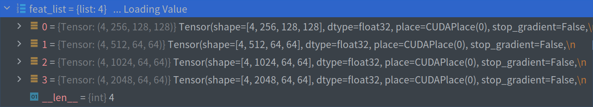

## deeplab.py 代码解析

## align_corners角点对齐操作
* [对输入数据进行上采样操作时的角点对齐方法](https://blog.csdn.net/wangweiwells/article/details/101820932)


## Decoder流程
```python
Decoder(nn.Layer):
    """
    Decoder module of DeepLabV3P model

    Args:
        num_classes (int): The number of classes.
        in_channels (int): The number of input channels in decoder module.
    """

    def __init__(self,
                 num_classes,
                 in_channels,
                 align_corners,
                 data_format='NCHW'):
        super(Decoder, self).__init__()

        self.data_format = data_format
        self.conv_bn_relu1 = layers.ConvBNReLU(
            in_channels=in_channels,
            out_channels=48,
            kernel_size=1,
            data_format=data_format)

        self.conv_bn_relu2 = layers.SeparableConvBNReLU(
            in_channels=304,
            out_channels=256,
            kernel_size=3,
            padding=1,
            data_format=data_format)
        self.conv_bn_relu3 = layers.SeparableConvBNReLU(
            in_channels=256,
            out_channels=256,
            kernel_size=3,
            padding=1,
            data_format=data_format)
        self.conv = nn.Conv2D(
            in_channels=256,
            out_channels=num_classes,
            kernel_size=1,
            data_format=data_format)

        self.align_corners = align_corners

    def forward(self, x, low_level_feat):
        low_level_feat = self.conv_bn_relu1(low_level_feat)
        if self.data_format == 'NCHW':
            low_level_shape = paddle.shape(low_level_feat)[-2:]
            axis = 1
        else:
            low_level_shape = paddle.shape(low_level_feat)[1:3]
            axis = -1
        x = F.interpolate(
            x,
            low_level_shape,
            mode='bilinear',
            align_corners=self.align_corners,
            data_format=self.data_format)
        x = paddle.concat([x, low_level_feat], axis=axis)
        x = self.conv_bn_relu2(x)
        x = self.conv_bn_relu3(x)
        x = self.conv(x)
        return x
```


## DeepLabV3P网络构建
```python
class DeepLabV3P(nn.Layer):
    """
    The DeepLabV3Plus implementation based on PaddlePaddle.

    The original article refers to
     Liang-Chieh Chen, et, al. "Encoder-Decoder with Atrous Separable Convolution for Semantic Image Segmentation"
     (https://arxiv.org/abs/1802.02611)

    Args:
        # 编码器配置，采用ASPP架构，pooling + 1x1_conv + 三个不同尺度的空洞卷积并行, concat后1x1conv
        # ASPP_WITH_SEP_CONV：默认为真，使用depthwise可分离卷积，否则使用普通卷积
        # OUTPUT_STRIDE: 下采样倍数，8或16，决定aspp_ratios大小
        # aspp_ratios：ASPP模块空洞卷积的采样率
        num_classes (int): The unique number of target classes.
        backbone (paddle.nn.Layer): Backbone network, currently support Resnet50_vd/Resnet101_vd/Xception65.
        # backbone_indices 是创建模型时需要传入的参数，该参数指定使用backbone返回的哪个特征图, backbone可以根据不同的块返回不同尺度的特征图
        backbone_indices (tuple, optional): Two values in the tuple indicate the indices of output of backbone.
           Default: (0, 3).
        aspp_ratios (tuple, optional): The dilation rate using in ASSP module. `dilation`为卷积核膨胀系数
            If output_stride=16, aspp_ratios should be set as (1, 6, 12, 18).
            If output_stride=8, aspp_ratios is (1, 12, 24, 36).
            Default: (1, 6, 12, 18).
        aspp_out_channels (int, optional): The output channels of ASPP module. Default: 256.
        align_corners (bool, optional): An argument of F.interpolate. It should be set to False when the feature size is even,
            e.g. 1024x512, otherwise it is True, e.g. 769x769. Default: False.
        pretrained (str, optional): The path or url of pretrained model. Default: None.
        data_format(str, optional): Data format that specifies the layout of input. It can be "NCHW" or "NHWC". Default: "NCHW".
    """

    def __init__(self,
                 num_classes,
                 backbone,
                 backbone_indices=(0, 3),
                 aspp_ratios=(1, 6, 12, 18),
                 aspp_out_channels=256,
                 align_corners=False,
                 pretrained=None,
                 data_format="NCHW"):
        super().__init__()

        self.backbone = backbone
        backbone_channels = [
            backbone.feat_channels[i] for i in backbone_indices
        ]

        self.head = DeepLabV3PHead(
            num_classes,
            backbone_indices,
            backbone_channels,
            aspp_ratios,
            aspp_out_channels,
            align_corners,
            data_format=data_format)

        self.align_corners = align_corners
        self.pretrained = pretrained
        self.data_format = data_format
        self.init_weight()

    def forward(self, x):
        feat_list = self.backbone(x)
        logit_list = self.head(feat_list)
        if self.data_format == 'NCHW':
            ori_shape = paddle.shape(x)[2:]
        else:
            ori_shape = paddle.shape(x)[1:3]
        return [
            F.interpolate(
                logit,
                ori_shape,
                mode='bilinear',
                align_corners=self.align_corners,
                data_format=self.data_format) for logit in logit_list
        ]

    def init_weight(self):
        if self.pretrained is not None:
            utils.load_entire_model(self, self.pretrained)
```

* `DeepLabV3P`在`backbone`网络的基础上添加了`DeepLabV3PHead`模块，`DeepLabV3PHead`模块包含了`ASPPModule`模块以及
`Decoder`模块，`ASPPModule`模块包含了空洞卷积以及自适应池化操作的融合模块
  
* DeepLabV3P网络架构
<details><summary>展开/收起</summary>
<pre><code>
DeepLabV3P(
  (backbone): ResNet_vd(
    (conv1_1): ConvBNLayer(
      (_pool2d_avg): AvgPool2D(kernel_size=2, stride=2, padding=0)
      (_conv): Conv2D(3, 32, kernel_size=[3, 3], stride=[2, 2], padding=1, data_format=NCHW)
      (_batch_norm): SyncBatchNorm(num_features=32, momentum=0.9, epsilon=1e-05)
      (_act_op): Activation(
        (act_func): ReLU()
      )
    )
    (conv1_2): ConvBNLayer(
      (_pool2d_avg): AvgPool2D(kernel_size=2, stride=2, padding=0)
      (_conv): Conv2D(32, 32, kernel_size=[3, 3], padding=1, data_format=NCHW)
      (_batch_norm): SyncBatchNorm(num_features=32, momentum=0.9, epsilon=1e-05)
      (_act_op): Activation(
        (act_func): ReLU()
      )
    )
    (conv1_3): ConvBNLayer(
      (_pool2d_avg): AvgPool2D(kernel_size=2, stride=2, padding=0)
      (_conv): Conv2D(32, 64, kernel_size=[3, 3], padding=1, data_format=NCHW)
      (_batch_norm): SyncBatchNorm(num_features=64, momentum=0.9, epsilon=1e-05)
      (_act_op): Activation(
        (act_func): ReLU()
      )
    )
    (pool2d_max): MaxPool2D(kernel_size=3, stride=2, padding=1)
    (bb_0_0): BottleneckBlock(
      (conv0): ConvBNLayer(
        (_pool2d_avg): AvgPool2D(kernel_size=2, stride=2, padding=0)
        (_conv): Conv2D(64, 64, kernel_size=[1, 1], data_format=NCHW)
        (_batch_norm): SyncBatchNorm(num_features=64, momentum=0.9, epsilon=1e-05)
        (_act_op): Activation(
          (act_func): ReLU()
        )
      )
      (conv1): ConvBNLayer(
        (_pool2d_avg): AvgPool2D(kernel_size=2, stride=2, padding=0)
        (_conv): Conv2D(64, 64, kernel_size=[3, 3], padding=1, data_format=NCHW)
        (_batch_norm): SyncBatchNorm(num_features=64, momentum=0.9, epsilon=1e-05)
        (_act_op): Activation(
          (act_func): ReLU()
        )
      )
      (conv2): ConvBNLayer(
        (_pool2d_avg): AvgPool2D(kernel_size=2, stride=2, padding=0)
        (_conv): Conv2D(64, 256, kernel_size=[1, 1], data_format=NCHW)
        (_batch_norm): SyncBatchNorm(num_features=256, momentum=0.9, epsilon=1e-05)
        (_act_op): Activation()
      )
      (short): ConvBNLayer(
        (_pool2d_avg): AvgPool2D(kernel_size=2, stride=2, padding=0)
        (_conv): Conv2D(64, 256, kernel_size=[1, 1], data_format=NCHW)
        (_batch_norm): SyncBatchNorm(num_features=256, momentum=0.9, epsilon=1e-05)
        (_act_op): Activation()
      )
    )
    (bb_0_1): BottleneckBlock(
      (conv0): ConvBNLayer(
        (_pool2d_avg): AvgPool2D(kernel_size=2, stride=2, padding=0)
        (_conv): Conv2D(256, 64, kernel_size=[1, 1], data_format=NCHW)
        (_batch_norm): SyncBatchNorm(num_features=64, momentum=0.9, epsilon=1e-05)
        (_act_op): Activation(
          (act_func): ReLU()
        )
      )
      (conv1): ConvBNLayer(
        (_pool2d_avg): AvgPool2D(kernel_size=2, stride=2, padding=0)
        (_conv): Conv2D(64, 64, kernel_size=[3, 3], padding=1, data_format=NCHW)
        (_batch_norm): SyncBatchNorm(num_features=64, momentum=0.9, epsilon=1e-05)
        (_act_op): Activation(
          (act_func): ReLU()
        )
      )
      (conv2): ConvBNLayer(
        (_pool2d_avg): AvgPool2D(kernel_size=2, stride=2, padding=0)
        (_conv): Conv2D(64, 256, kernel_size=[1, 1], data_format=NCHW)
        (_batch_norm): SyncBatchNorm(num_features=256, momentum=0.9, epsilon=1e-05)
        (_act_op): Activation()
      )
    )
    (bb_0_2): BottleneckBlock(
      (conv0): ConvBNLayer(
        (_pool2d_avg): AvgPool2D(kernel_size=2, stride=2, padding=0)
        (_conv): Conv2D(256, 64, kernel_size=[1, 1], data_format=NCHW)
        (_batch_norm): SyncBatchNorm(num_features=64, momentum=0.9, epsilon=1e-05)
        (_act_op): Activation(
          (act_func): ReLU()
        )
      )
      (conv1): ConvBNLayer(
        (_pool2d_avg): AvgPool2D(kernel_size=2, stride=2, padding=0)
        (_conv): Conv2D(64, 64, kernel_size=[3, 3], padding=1, data_format=NCHW)
        (_batch_norm): SyncBatchNorm(num_features=64, momentum=0.9, epsilon=1e-05)
        (_act_op): Activation(
          (act_func): ReLU()
        )
      )
      (conv2): ConvBNLayer(
        (_pool2d_avg): AvgPool2D(kernel_size=2, stride=2, padding=0)
        (_conv): Conv2D(64, 256, kernel_size=[1, 1], data_format=NCHW)
        (_batch_norm): SyncBatchNorm(num_features=256, momentum=0.9, epsilon=1e-05)
        (_act_op): Activation()
      )
    )
    (bb_1_0): BottleneckBlock(
      (conv0): ConvBNLayer(
        (_pool2d_avg): AvgPool2D(kernel_size=2, stride=2, padding=0)
        (_conv): Conv2D(256, 128, kernel_size=[1, 1], data_format=NCHW)
        (_batch_norm): SyncBatchNorm(num_features=128, momentum=0.9, epsilon=1e-05)
        (_act_op): Activation(
          (act_func): ReLU()
        )
      )
      (conv1): ConvBNLayer(
        (_pool2d_avg): AvgPool2D(kernel_size=2, stride=2, padding=0)
        (_conv): Conv2D(128, 128, kernel_size=[3, 3], stride=[2, 2], padding=1, data_format=NCHW)
        (_batch_norm): SyncBatchNorm(num_features=128, momentum=0.9, epsilon=1e-05)
        (_act_op): Activation(
          (act_func): ReLU()
        )
      )
      (conv2): ConvBNLayer(
        (_pool2d_avg): AvgPool2D(kernel_size=2, stride=2, padding=0)
        (_conv): Conv2D(128, 512, kernel_size=[1, 1], data_format=NCHW)
        (_batch_norm): SyncBatchNorm(num_features=512, momentum=0.9, epsilon=1e-05)
        (_act_op): Activation()
      )
      (short): ConvBNLayer(
        (_pool2d_avg): AvgPool2D(kernel_size=2, stride=2, padding=0)
        (_conv): Conv2D(256, 512, kernel_size=[1, 1], data_format=NCHW)
        (_batch_norm): SyncBatchNorm(num_features=512, momentum=0.9, epsilon=1e-05)
        (_act_op): Activation()
      )
    )
    (bb_1_1): BottleneckBlock(
      (conv0): ConvBNLayer(
        (_pool2d_avg): AvgPool2D(kernel_size=2, stride=2, padding=0)
        (_conv): Conv2D(512, 128, kernel_size=[1, 1], data_format=NCHW)
        (_batch_norm): SyncBatchNorm(num_features=128, momentum=0.9, epsilon=1e-05)
        (_act_op): Activation(
          (act_func): ReLU()
        )
      )
      (conv1): ConvBNLayer(
        (_pool2d_avg): AvgPool2D(kernel_size=2, stride=2, padding=0)
        (_conv): Conv2D(128, 128, kernel_size=[3, 3], padding=1, data_format=NCHW)
        (_batch_norm): SyncBatchNorm(num_features=128, momentum=0.9, epsilon=1e-05)
        (_act_op): Activation(
          (act_func): ReLU()
        )
      )
      (conv2): ConvBNLayer(
        (_pool2d_avg): AvgPool2D(kernel_size=2, stride=2, padding=0)
        (_conv): Conv2D(128, 512, kernel_size=[1, 1], data_format=NCHW)
        (_batch_norm): SyncBatchNorm(num_features=512, momentum=0.9, epsilon=1e-05)
        (_act_op): Activation()
      )
    )
    (bb_1_2): BottleneckBlock(
      (conv0): ConvBNLayer(
        (_pool2d_avg): AvgPool2D(kernel_size=2, stride=2, padding=0)
        (_conv): Conv2D(512, 128, kernel_size=[1, 1], data_format=NCHW)
        (_batch_norm): SyncBatchNorm(num_features=128, momentum=0.9, epsilon=1e-05)
        (_act_op): Activation(
          (act_func): ReLU()
        )
      )
      (conv1): ConvBNLayer(
        (_pool2d_avg): AvgPool2D(kernel_size=2, stride=2, padding=0)
        (_conv): Conv2D(128, 128, kernel_size=[3, 3], padding=1, data_format=NCHW)
        (_batch_norm): SyncBatchNorm(num_features=128, momentum=0.9, epsilon=1e-05)
        (_act_op): Activation(
          (act_func): ReLU()
        )
      )
      (conv2): ConvBNLayer(
        (_pool2d_avg): AvgPool2D(kernel_size=2, stride=2, padding=0)
        (_conv): Conv2D(128, 512, kernel_size=[1, 1], data_format=NCHW)
        (_batch_norm): SyncBatchNorm(num_features=512, momentum=0.9, epsilon=1e-05)
        (_act_op): Activation()
      )
    )
    (bb_1_3): BottleneckBlock(
      (conv0): ConvBNLayer(
        (_pool2d_avg): AvgPool2D(kernel_size=2, stride=2, padding=0)
        (_conv): Conv2D(512, 128, kernel_size=[1, 1], data_format=NCHW)
        (_batch_norm): SyncBatchNorm(num_features=128, momentum=0.9, epsilon=1e-05)
        (_act_op): Activation(
          (act_func): ReLU()
        )
      )
      (conv1): ConvBNLayer(
        (_pool2d_avg): AvgPool2D(kernel_size=2, stride=2, padding=0)
        (_conv): Conv2D(128, 128, kernel_size=[3, 3], padding=1, data_format=NCHW)
        (_batch_norm): SyncBatchNorm(num_features=128, momentum=0.9, epsilon=1e-05)
        (_act_op): Activation(
          (act_func): ReLU()
        )
      )
      (conv2): ConvBNLayer(
        (_pool2d_avg): AvgPool2D(kernel_size=2, stride=2, padding=0)
        (_conv): Conv2D(128, 512, kernel_size=[1, 1], data_format=NCHW)
        (_batch_norm): SyncBatchNorm(num_features=512, momentum=0.9, epsilon=1e-05)
        (_act_op): Activation()
      )
    )
    (bb_2_0): BottleneckBlock(
      (conv0): ConvBNLayer(
        (_pool2d_avg): AvgPool2D(kernel_size=2, stride=2, padding=0)
        (_conv): Conv2D(512, 256, kernel_size=[1, 1], data_format=NCHW)
        (_batch_norm): SyncBatchNorm(num_features=256, momentum=0.9, epsilon=1e-05)
        (_act_op): Activation(
          (act_func): ReLU()
        )
      )
      (conv1): ConvBNLayer(
        (_pool2d_avg): AvgPool2D(kernel_size=2, stride=2, padding=0)
        (_conv): Conv2D(256, 256, kernel_size=[3, 3], dilation=[2, 2], data_format=NCHW)
        (_batch_norm): SyncBatchNorm(num_features=256, momentum=0.9, epsilon=1e-05)
        (_act_op): Activation(
          (act_func): ReLU()
        )
      )
      (conv2): ConvBNLayer(
        (_pool2d_avg): AvgPool2D(kernel_size=2, stride=2, padding=0)
        (_conv): Conv2D(256, 1024, kernel_size=[1, 1], data_format=NCHW)
        (_batch_norm): SyncBatchNorm(num_features=1024, momentum=0.9, epsilon=1e-05)
        (_act_op): Activation()
      )
      (short): ConvBNLayer(
        (_pool2d_avg): AvgPool2D(kernel_size=2, stride=2, padding=0)
        (_conv): Conv2D(512, 1024, kernel_size=[1, 1], data_format=NCHW)
        (_batch_norm): SyncBatchNorm(num_features=1024, momentum=0.9, epsilon=1e-05)
        (_act_op): Activation()
      )
    )
    (bb_2_1): BottleneckBlock(
      (conv0): ConvBNLayer(
        (_pool2d_avg): AvgPool2D(kernel_size=2, stride=2, padding=0)
        (_conv): Conv2D(1024, 256, kernel_size=[1, 1], data_format=NCHW)
        (_batch_norm): SyncBatchNorm(num_features=256, momentum=0.9, epsilon=1e-05)
        (_act_op): Activation(
          (act_func): ReLU()
        )
      )
      (conv1): ConvBNLayer(
        (_pool2d_avg): AvgPool2D(kernel_size=2, stride=2, padding=0)
        (_conv): Conv2D(256, 256, kernel_size=[3, 3], dilation=[2, 2], data_format=NCHW)
        (_batch_norm): SyncBatchNorm(num_features=256, momentum=0.9, epsilon=1e-05)
        (_act_op): Activation(
          (act_func): ReLU()
        )
      )
      (conv2): ConvBNLayer(
        (_pool2d_avg): AvgPool2D(kernel_size=2, stride=2, padding=0)
        (_conv): Conv2D(256, 1024, kernel_size=[1, 1], data_format=NCHW)
        (_batch_norm): SyncBatchNorm(num_features=1024, momentum=0.9, epsilon=1e-05)
        (_act_op): Activation()
      )
    )
    (bb_2_2): BottleneckBlock(
      (conv0): ConvBNLayer(
        (_pool2d_avg): AvgPool2D(kernel_size=2, stride=2, padding=0)
        (_conv): Conv2D(1024, 256, kernel_size=[1, 1], data_format=NCHW)
        (_batch_norm): SyncBatchNorm(num_features=256, momentum=0.9, epsilon=1e-05)
        (_act_op): Activation(
          (act_func): ReLU()
        )
      )
      (conv1): ConvBNLayer(
        (_pool2d_avg): AvgPool2D(kernel_size=2, stride=2, padding=0)
        (_conv): Conv2D(256, 256, kernel_size=[3, 3], dilation=[2, 2], data_format=NCHW)
        (_batch_norm): SyncBatchNorm(num_features=256, momentum=0.9, epsilon=1e-05)
        (_act_op): Activation(
          (act_func): ReLU()
        )
      )
      (conv2): ConvBNLayer(
        (_pool2d_avg): AvgPool2D(kernel_size=2, stride=2, padding=0)
        (_conv): Conv2D(256, 1024, kernel_size=[1, 1], data_format=NCHW)
        (_batch_norm): SyncBatchNorm(num_features=1024, momentum=0.9, epsilon=1e-05)
        (_act_op): Activation()
      )
    )
    (bb_2_3): BottleneckBlock(
      (conv0): ConvBNLayer(
        (_pool2d_avg): AvgPool2D(kernel_size=2, stride=2, padding=0)
        (_conv): Conv2D(1024, 256, kernel_size=[1, 1], data_format=NCHW)
        (_batch_norm): SyncBatchNorm(num_features=256, momentum=0.9, epsilon=1e-05)
        (_act_op): Activation(
          (act_func): ReLU()
        )
      )
      (conv1): ConvBNLayer(
        (_pool2d_avg): AvgPool2D(kernel_size=2, stride=2, padding=0)
        (_conv): Conv2D(256, 256, kernel_size=[3, 3], dilation=[2, 2], data_format=NCHW)
        (_batch_norm): SyncBatchNorm(num_features=256, momentum=0.9, epsilon=1e-05)
        (_act_op): Activation(
          (act_func): ReLU()
        )
      )
      (conv2): ConvBNLayer(
        (_pool2d_avg): AvgPool2D(kernel_size=2, stride=2, padding=0)
        (_conv): Conv2D(256, 1024, kernel_size=[1, 1], data_format=NCHW)
        (_batch_norm): SyncBatchNorm(num_features=1024, momentum=0.9, epsilon=1e-05)
        (_act_op): Activation()
      )
    )
    (bb_2_4): BottleneckBlock(
      (conv0): ConvBNLayer(
        (_pool2d_avg): AvgPool2D(kernel_size=2, stride=2, padding=0)
        (_conv): Conv2D(1024, 256, kernel_size=[1, 1], data_format=NCHW)
        (_batch_norm): SyncBatchNorm(num_features=256, momentum=0.9, epsilon=1e-05)
        (_act_op): Activation(
          (act_func): ReLU()
        )
      )
      (conv1): ConvBNLayer(
        (_pool2d_avg): AvgPool2D(kernel_size=2, stride=2, padding=0)
        (_conv): Conv2D(256, 256, kernel_size=[3, 3], dilation=[2, 2], data_format=NCHW)
        (_batch_norm): SyncBatchNorm(num_features=256, momentum=0.9, epsilon=1e-05)
        (_act_op): Activation(
          (act_func): ReLU()
        )
      )
      (conv2): ConvBNLayer(
        (_pool2d_avg): AvgPool2D(kernel_size=2, stride=2, padding=0)
        (_conv): Conv2D(256, 1024, kernel_size=[1, 1], data_format=NCHW)
        (_batch_norm): SyncBatchNorm(num_features=1024, momentum=0.9, epsilon=1e-05)
        (_act_op): Activation()
      )
    )
    (bb_2_5): BottleneckBlock(
      (conv0): ConvBNLayer(
        (_pool2d_avg): AvgPool2D(kernel_size=2, stride=2, padding=0)
        (_conv): Conv2D(1024, 256, kernel_size=[1, 1], data_format=NCHW)
        (_batch_norm): SyncBatchNorm(num_features=256, momentum=0.9, epsilon=1e-05)
        (_act_op): Activation(
          (act_func): ReLU()
        )
      )
      (conv1): ConvBNLayer(
        (_pool2d_avg): AvgPool2D(kernel_size=2, stride=2, padding=0)
        (_conv): Conv2D(256, 256, kernel_size=[3, 3], dilation=[2, 2], data_format=NCHW)
        (_batch_norm): SyncBatchNorm(num_features=256, momentum=0.9, epsilon=1e-05)
        (_act_op): Activation(
          (act_func): ReLU()
        )
      )
      (conv2): ConvBNLayer(
        (_pool2d_avg): AvgPool2D(kernel_size=2, stride=2, padding=0)
        (_conv): Conv2D(256, 1024, kernel_size=[1, 1], data_format=NCHW)
        (_batch_norm): SyncBatchNorm(num_features=1024, momentum=0.9, epsilon=1e-05)
        (_act_op): Activation()
      )
    )
    (bb_3_0): BottleneckBlock(
      (conv0): ConvBNLayer(
        (_pool2d_avg): AvgPool2D(kernel_size=2, stride=2, padding=0)
        (_conv): Conv2D(1024, 512, kernel_size=[1, 1], data_format=NCHW)
        (_batch_norm): SyncBatchNorm(num_features=512, momentum=0.9, epsilon=1e-05)
        (_act_op): Activation(
          (act_func): ReLU()
        )
      )
      (conv1): ConvBNLayer(
        (_pool2d_avg): AvgPool2D(kernel_size=2, stride=2, padding=0)
        (_conv): Conv2D(512, 512, kernel_size=[3, 3], dilation=[4, 4], data_format=NCHW)
        (_batch_norm): SyncBatchNorm(num_features=512, momentum=0.9, epsilon=1e-05)
        (_act_op): Activation(
          (act_func): ReLU()
        )
      )
      (conv2): ConvBNLayer(
        (_pool2d_avg): AvgPool2D(kernel_size=2, stride=2, padding=0)
        (_conv): Conv2D(512, 2048, kernel_size=[1, 1], data_format=NCHW)
        (_batch_norm): SyncBatchNorm(num_features=2048, momentum=0.9, epsilon=1e-05)
        (_act_op): Activation()
      )
      (short): ConvBNLayer(
        (_pool2d_avg): AvgPool2D(kernel_size=2, stride=2, padding=0)
        (_conv): Conv2D(1024, 2048, kernel_size=[1, 1], data_format=NCHW)
        (_batch_norm): SyncBatchNorm(num_features=2048, momentum=0.9, epsilon=1e-05)
        (_act_op): Activation()
      )
    )
    (bb_3_1): BottleneckBlock(
      (conv0): ConvBNLayer(
        (_pool2d_avg): AvgPool2D(kernel_size=2, stride=2, padding=0)
        (_conv): Conv2D(2048, 512, kernel_size=[1, 1], data_format=NCHW)
        (_batch_norm): SyncBatchNorm(num_features=512, momentum=0.9, epsilon=1e-05)
        (_act_op): Activation(
          (act_func): ReLU()
        )
      )
      (conv1): ConvBNLayer(
        (_pool2d_avg): AvgPool2D(kernel_size=2, stride=2, padding=0)
        (_conv): Conv2D(512, 512, kernel_size=[3, 3], dilation=[4, 4], data_format=NCHW)
        (_batch_norm): SyncBatchNorm(num_features=512, momentum=0.9, epsilon=1e-05)
        (_act_op): Activation(
          (act_func): ReLU()
        )
      )
      (conv2): ConvBNLayer(
        (_pool2d_avg): AvgPool2D(kernel_size=2, stride=2, padding=0)
        (_conv): Conv2D(512, 2048, kernel_size=[1, 1], data_format=NCHW)
        (_batch_norm): SyncBatchNorm(num_features=2048, momentum=0.9, epsilon=1e-05)
        (_act_op): Activation()
      )
    )
    (bb_3_2): BottleneckBlock(
      (conv0): ConvBNLayer(
        (_pool2d_avg): AvgPool2D(kernel_size=2, stride=2, padding=0)
        (_conv): Conv2D(2048, 512, kernel_size=[1, 1], data_format=NCHW)
        (_batch_norm): SyncBatchNorm(num_features=512, momentum=0.9, epsilon=1e-05)
        (_act_op): Activation(
          (act_func): ReLU()
        )
      )
      (conv1): ConvBNLayer(
        (_pool2d_avg): AvgPool2D(kernel_size=2, stride=2, padding=0)
        (_conv): Conv2D(512, 512, kernel_size=[3, 3], dilation=[4, 4], data_format=NCHW)
        (_batch_norm): SyncBatchNorm(num_features=512, momentum=0.9, epsilon=1e-05)
        (_act_op): Activation(
          (act_func): ReLU()
        )
      )
      (conv2): ConvBNLayer(
        (_pool2d_avg): AvgPool2D(kernel_size=2, stride=2, padding=0)
        (_conv): Conv2D(512, 2048, kernel_size=[1, 1], data_format=NCHW)
        (_batch_norm): SyncBatchNorm(num_features=2048, momentum=0.9, epsilon=1e-05)
        (_act_op): Activation()
      )
    )
  )
  (head): DeepLabV3PHead(
    (aspp): ASPPModule(
      (aspp_blocks): LayerList(
        (0): ConvBNReLU(
          (_conv): Conv2D(2048, 256, kernel_size=[1, 1], data_format=NCHW)
          (_batch_norm): SyncBatchNorm(num_features=256, momentum=0.9, epsilon=1e-05)
        )
        (1): SeparableConvBNReLU(
          (depthwise_conv): ConvBN(
            (_conv): Conv2D(2048, 2048, kernel_size=[3, 3], padding=12, dilation=[12, 12], groups=2048, data_format=NCHW)
            (_batch_norm): SyncBatchNorm(num_features=2048, momentum=0.9, epsilon=1e-05)
          )
          (piontwise_conv): ConvBNReLU(
            (_conv): Conv2D(2048, 256, kernel_size=[1, 1], padding=same, data_format=NCHW)
            (_batch_norm): SyncBatchNorm(num_features=256, momentum=0.9, epsilon=1e-05)
          )
        )
        (2): SeparableConvBNReLU(
          (depthwise_conv): ConvBN(
            (_conv): Conv2D(2048, 2048, kernel_size=[3, 3], padding=24, dilation=[24, 24], groups=2048, data_format=NCHW)
            (_batch_norm): SyncBatchNorm(num_features=2048, momentum=0.9, epsilon=1e-05)
          )
          (piontwise_conv): ConvBNReLU(
            (_conv): Conv2D(2048, 256, kernel_size=[1, 1], padding=same, data_format=NCHW)
            (_batch_norm): SyncBatchNorm(num_features=256, momentum=0.9, epsilon=1e-05)
          )
        )
        (3): SeparableConvBNReLU(
          (depthwise_conv): ConvBN(
            (_conv): Conv2D(2048, 2048, kernel_size=[3, 3], padding=36, dilation=[36, 36], groups=2048, data_format=NCHW)
            (_batch_norm): SyncBatchNorm(num_features=2048, momentum=0.9, epsilon=1e-05)
          )
          (piontwise_conv): ConvBNReLU(
            (_conv): Conv2D(2048, 256, kernel_size=[1, 1], padding=same, data_format=NCHW)
            (_batch_norm): SyncBatchNorm(num_features=256, momentum=0.9, epsilon=1e-05)
          )
        )
      )
      (global_avg_pool): Sequential(
        (0): AdaptiveAvgPool2D(output_size=(1, 1))
        (1): ConvBNReLU(
          (_conv): Conv2D(2048, 256, kernel_size=[1, 1], padding=same, data_format=NCHW)
          (_batch_norm): SyncBatchNorm(num_features=256, momentum=0.9, epsilon=1e-05)
        )
      )
      (conv_bn_relu): ConvBNReLU(
        (_conv): Conv2D(1280, 256, kernel_size=[1, 1], padding=same, data_format=NCHW)
        (_batch_norm): SyncBatchNorm(num_features=256, momentum=0.9, epsilon=1e-05)
      )
      (dropout): Dropout(p=0.1, axis=None, mode=upscale_in_train)
    )
    (decoder): Decoder(
      (conv_bn_relu1): ConvBNReLU(
        (_conv): Conv2D(256, 48, kernel_size=[1, 1], padding=same, data_format=NCHW)
        (_batch_norm): SyncBatchNorm(num_features=48, momentum=0.9, epsilon=1e-05)
      )
      (conv_bn_relu2): SeparableConvBNReLU(
        (depthwise_conv): ConvBN(
          (_conv): Conv2D(304, 304, kernel_size=[3, 3], padding=1, groups=304, data_format=NCHW)
          (_batch_norm): SyncBatchNorm(num_features=304, momentum=0.9, epsilon=1e-05)
        )
        (piontwise_conv): ConvBNReLU(
          (_conv): Conv2D(304, 256, kernel_size=[1, 1], padding=same, data_format=NCHW)
          (_batch_norm): SyncBatchNorm(num_features=256, momentum=0.9, epsilon=1e-05)
        )
      )
      (conv_bn_relu3): SeparableConvBNReLU(
        (depthwise_conv): ConvBN(
          (_conv): Conv2D(256, 256, kernel_size=[3, 3], padding=1, groups=256, data_format=NCHW)
          (_batch_norm): SyncBatchNorm(num_features=256, momentum=0.9, epsilon=1e-05)
        )
        (piontwise_conv): ConvBNReLU(
          (_conv): Conv2D(256, 256, kernel_size=[1, 1], padding=same, data_format=NCHW)
          (_batch_norm): SyncBatchNorm(num_features=256, momentum=0.9, epsilon=1e-05)
        )
      )
      (conv): Conv2D(256, 3, kernel_size=[1, 1], data_format=NCHW)
    )
  )
)
</code></pre>
</details>  

* DeepLabV3P网络结构缩略图
```text
DeepLabV3P(
  (backbone): ResNet_vd(...
  )
  (head): DeepLabV3PHead(
    (aspp): ASPPModule(
      )
      (global_avg_pool): Sequential(
        (0): AdaptiveAvgPool2D(output_size=(1, 1))
        (1): ConvBNReLU(
          (_conv): Conv2D(2048, 256, kernel_size=[1, 1], padding=same, data_format=NCHW)
          (_batch_norm): SyncBatchNorm(num_features=256, momentum=0.9, epsilon=1e-05)
        )
      )
      (conv_bn_relu): ConvBNReLU(
        (_conv): Conv2D(1280, 256, kernel_size=[1, 1], padding=same, data_format=NCHW)
        (_batch_norm): SyncBatchNorm(num_features=256, momentum=0.9, epsilon=1e-05)
      )
      (dropout): Dropout(p=0.1, axis=None, mode=upscale_in_train)
    )
    (decoder): Decoder(
      (conv_bn_relu1): 
      (conv_bn_relu2): 
      (conv_bn_relu3): 
      (conv): Conv2D(256, 3, kernel_size=[1, 1], data_format=NCHW)
    )
  )
)
```
## DeepLabV3P推理代码
```python
    def forward(self, x):
        feat_list = self.backbone(x)
        logit_list = self.head(feat_list)
        return [
            F.interpolate(
                logit,
                paddle.shape(x)[2:],
                mode='bilinear',
                align_corners=self.align_corners) for logit in logit_list
        ]
```
* DeepLabV3P推理过程包含了`backbone`以及`head`阶段，以及最后的双线性插值阶段
* 输入是n*3*512*512经过`backbone`阶段之后的大小是
  
经过`head`阶段之后的大小是n*3*128*128，最后再通过双线性插值而得到n*3*512*512大小的预测图，每一个像素点表示如下加权后的分类损失之和
```python
losses = [
                    paddleseg.models.CrossEntropyLoss(),
                    paddleseg.models.LovaszSoftmaxLoss() # 采用了iou loss
                ]
                coef = [.8, .2]
                loss_type = [
                    paddleseg.models.MixedLoss(
                        losses=losses, coef=coef),
                ]
```
  
## 参考链接
* 1 

